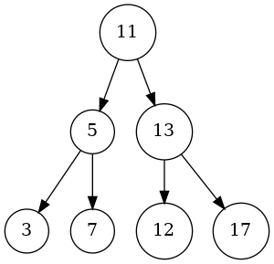
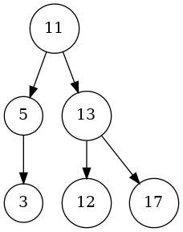
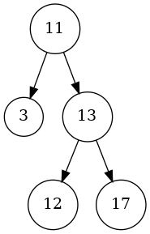
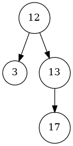

## Binary Search Tree

A Binary Search Tree (BST) is a specialized type of binary tree where each node follows a specific ordering property:

- The **left subtree** of a node contains only nodes with values less than the node's value.
- The **right subtree** of a node contains only nodes with values greater than the node's value.
- Both the left and right subtrees must also be binary search trees.

A BST is considered balanced if the depth of the left and right subtrees of every node differs by at most one.

Balanced BSTs have a time complexity of **O(log n)** for search, insertion, and deletion operations.

## Binary Search Tree Insertion 

In the BST, the left child of a node has a value less than the parent node, and the right child has a value greater than the parent node.

According to BST rules, the insertion of a value should be on the left side of the node (root) if the value is less than the node (root) or else on the right side of the node (root).

After inserting the values '[11, 13, 5, 7, 17, 3, 12]' in the BST, the Binary Search Tree will look like:

## Binary Search Tree Deletion

### **Node Deletion Cases**
When implementing deletion in a **Binary Search Tree (BST)**, there are three main cases to consider:

1. **Deleting a Leaf Node (Node with No Children)**
   - Deleting '7' from the above BST '[11, 13, 5, 7, 17, 3, 12]'.
   - The node is simply removed because it doesn't have any children.
   - After deleting the leaf node, the tree will look like:
          
     

2. **Deleting a Node with One Child**
   - Deleting '5' from the above BST (after deleting '7') '[11, 13, 5, 17, 3, 12]'.
   - The child will replace the deleted node.
   - After deleting the node with one child, the tree will look like:

     

3. **Deleting a Node with Two Children**
   - Deleting '11' from the above BST (after deleting '5') '[11, 13, 17, 3, 12]'.
   -  When deleting a node with two children, two values can be used as replacements:
      - **Inorder Successor** (smallest value in the right subtree)
      - **Inorder Predecessor** (largest value in the left subtree)
   - In my implementation, I used **Inorder Successor** to replace the deleted node because:
     - It maintains the structure efficiently.
     - The right subtree is already built to handle larger values.
     - I believe in high-level BSTs; it is simple to replace a node (root) with an inorder successor, then an inorder predecessor.
   - Alternatively, the **inorder predecessor** (largest value in the left subtree) could be used, but the successor is more common.

   - After deleting the node with two children, the tree will look like:

     

This deletion implementation is also working efficiently with an empty tree and a single-node tree too.

## Challenges Faced

- One of the main challenges was ensuring pointer updates were handled correctly. If we don’t return the correct subtree pointer, the deletion logic fails. The biggest mistake was forgetting to return the updated root when making recursive calls.

- Finding the inorder successor and replacing the deleted node with it.

- Visualizing the BST using Graphviz helps me a lot to overcome all the challenges that I have faced during implementation.
