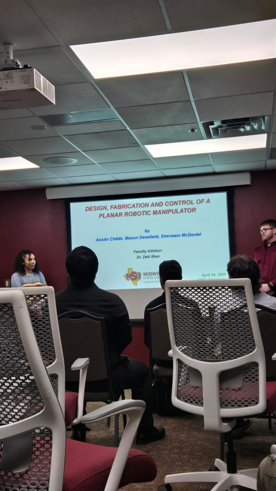

|        Design, Fabrication and Control of a Planar Robotic Manipulator        |
| :---------------------------------------------------------------------------: |
|  |
| This image is from a talk about a robotic arm. The presenters explained how they built and controlled the arm using two stepper motors. Their current model is capable of drawing shapes like rectangles and circles. It was a great presentation — I learned a lot about stepper motors, kinematics, and how motion is translated through mechanical design. |
